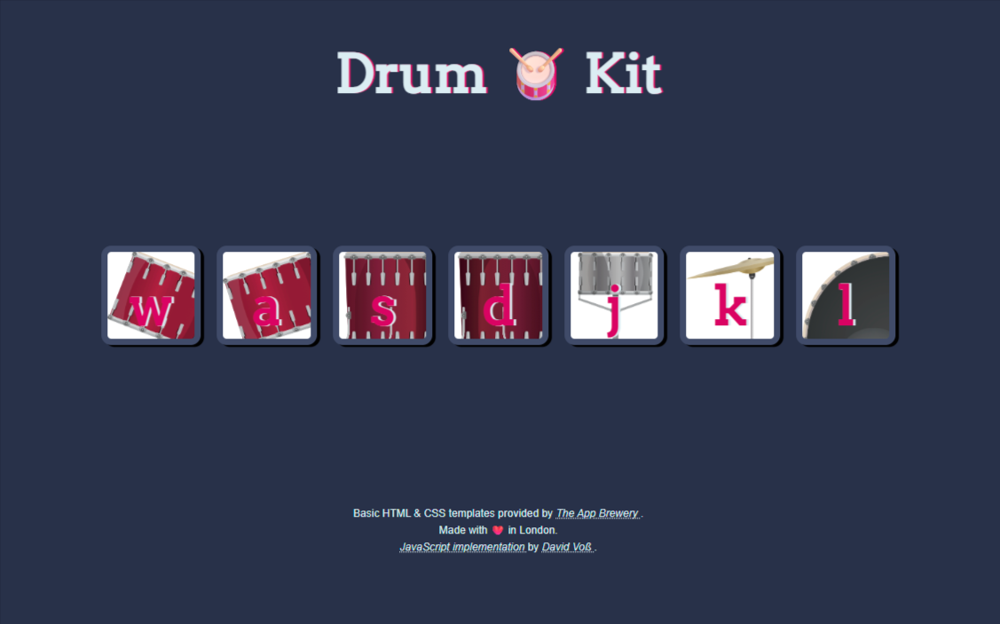
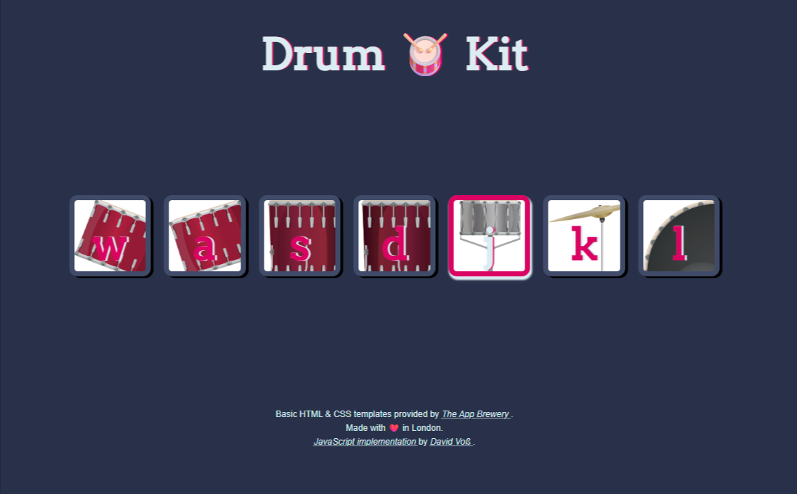

# &#129345; Drum Kit

A browser-based interactive drum kit built with HTML, CSS, and JavaScript.  
Users can play different drum sounds by either clicking on-screen buttons or pressing the corresponding keys on the keyboard.

---

This project was created as a practice exercise to consolidate JavaScript knowledge from  
[_Dr. Angela Yu's_](https://www.udemy.com/course/the-complete-web-development-bootcamp/) Udemy course:  
**"The Complete Full-Stack Web Development Bootcamp"**.

The focus was on:

- DOM manipulation  
- higher-order functions  
- callback functions

The HTML and CSS templates were provided by **The App Brewery** as part of the course.  
I made a few minor adjustments – for example, refining the visual feedback for active buttons.

---

> &#9888;&#65039;&#128241; **Note:** This project was designed and tested primarily for desktop browsers using mouse and keyboard input.  
> Touchscreen support may be limited or inconsistent, especially on mobile devices.

> **&#128279; Live Demo on GitHub Pages:**  
> &#128073; [Drum Kit Web App](https://david-voss.github.io/Drum-Kit/)

---

## Table of contents
1. &#128444;&#65039; Preview of the application
2. &#127760; Features
3. &#129489;&#8205;&#128187; Technologies Used
4. &#9000;&#65039; Key Mapping
5. &#128203; Code Overview
6. &#128218; JavaScript Function Overview
7. &#169;&#65039; Author & Credits

## 1. &#128444;&#65039; Preview of the application:
### **_Default button state:_**
  
---
### **_Style change while a button is pressed:_**
  
---

## 2. &#127760; Features

- Responsive button- and keyboard-based interaction
- Smooth visual feedback on button press and release
- Sound playback triggered via keys (`w`, `a`, `s`, `d`, `j`, `k`, `l`)
- Accessible design with support for mouse, keyboard, and touch events
- Clean code structure following modern best practices

---

## 3. &#129489;&#8205;&#128187; Technologies Used

- HTML5
- CSS3
- JavaScript

---

## 4. &#9000;&#65039; Key Mapping

| Key | Sound         |
|-----|---------------|
| w   | Tom 1         |
| a   | Tom 2         |
| s   | Tom 3         |
| d   | Tom 4         |
| j   | Snare Drum    |
| k   | Crash Cymbal  |
| l   | Kick Bass     |

---

## 5. &#128203; Code Overview

The script is structured into the following logical sections:

- `DOM References & Constants`
- `Initialisation Entry Point (init)`
- `Event Listener Setup`
- `Logic Functions`
- `Event Handlers`
- `Utility Functions`

Each function is clearly named and documented for easy readability and maintainability.

---

## 6. &#128218; JavaScript Function Overview

The table below summarises the core functions and their responsibilities:

| Function                            | Purpose                                                                 |
|-------------------------------------|-------------------------------------------------------------------------|
| `init()`                            | Entry point: initialises the app by registering all required event listeners. |
| `registerEventListeners()`          | Attaches mouse, touch, and keyboard listeners to each drum button.      |
| `registerReleaseCleanup(event)`     | Ensures that buttons visually reset if the user releases the mouse or touch **outside** the button element. |
| `addButtonListener(element, event, callback)` | Adds a specific event listener to a button and invokes the callback on interaction. |
| `addDocumentListener(element, event, callback, ...additionalCallbacks)` | Registers a global keyboard event listener and triggers the appropriate callbacks if a matching key is pressed. |
| `setUpSound(btn)`                   | Retrieves the `data-key` attribute from a button and plays the corresponding sound. |
| `addSoundToButtons(key)`            | Plays a sound corresponding to the specified key.    |
| `initSound(soundSource)`            | Instantiates and plays a new `Audio` object using the provided sound path. |
| `setButtonpressedStyle(btn)`        | Adds the `.pressed` CSS class to apply a visual pressed effect.         |
| `setButtonReleasedStyle(btn)`       | Removes the `.pressed` class when a button is released.                 |

---

## 7. &#169;&#65039; Author & Credits

- Basic HTML & CSS template provided by <a 
          href="https://appbrewery.com/" 
          title="Visit The App Brewery" 
          target="_blank" 
          rel="noopener noreferrer">
          The App Brewery
        </a>.
- JavaScript implementation and enhancements by <a 
          href="https://github.com/David-Voss" 
          title="Visit David Voß’s GitHub profile" 
          target="_blank" 
          rel="noopener noreferrer">
          David Voß
        </a>.